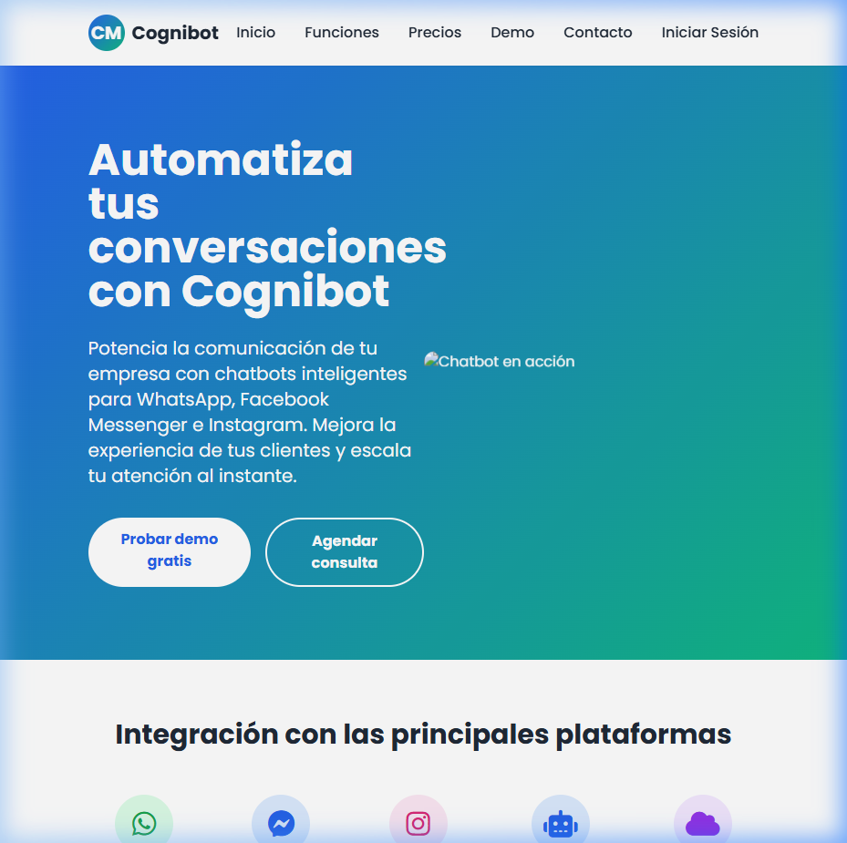
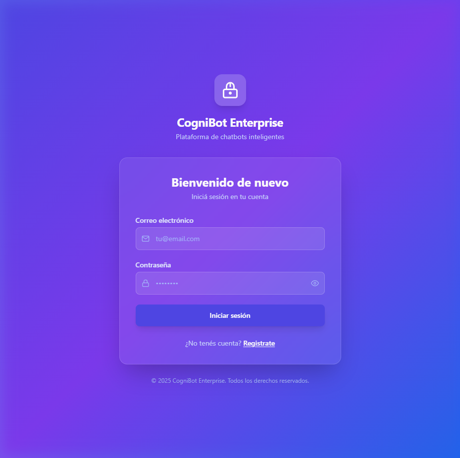

# 🤖 Cognibot — Visual Chatbot Flow Builder

> **Automatizá tus conversaciones** con un constructor visual de flujos para WhatsApp, Facebook Messenger e Instagram.

<div align="center">

**[🚀 Ver Demo en Vivo](http://67.205.171.161:8080/landing.html)** &nbsp;|&nbsp; **[📱 Iniciar Sesión](http://67.205.171.161:8080/login.html)**


</div>

---

## 📸 Vista previa

| Landing Page | Login |
|---|---|
|  |  |

---

## ✨ Funcionalidades

- 🎨 **Constructor visual drag & drop** — diseñá flujos con nodos conectables en un canvas
- 💬 **Tipos de nodos** — Mensaje, Opciones, Condición, Delay, Input, Acción, Fin
- 📲 **Integración WhatsApp** — conectá a la Meta Cloud API para publicar flujos
- 🔐 **Autenticación JWT** — sistema de login/registro seguro
- 🧪 **Simulador de chat** — probá tus flujos antes de publicarlos
- 📊 **Dashboard y analytics** — seguí conversaciones y rendimiento del bot
- 📁 **Multi-proyecto** — gestioná múltiples chatbots desde una sola cuenta

---

## 🏗️ Stack tecnológico

| Capa | Tecnología |
|------|-----------|
| Frontend | React 18, Vite, TypeScript, Tailwind CSS, shadcn/ui |
| Canvas | @xyflow/react (React Flow) |
| Backend | FastAPI, SQLAlchemy, Uvicorn |
| Base de datos | MySQL 8.0 |
| Autenticación | JWT (python-jose + passlib) |
| Deploy | Docker, Docker Compose, Nginx |

---

## 🚀 Inicio rápido (Local)

### Prerequisitos
- [Docker Desktop](https://www.docker.com/products/docker-desktop/) instalado

### 1. Clonar el repo
```bash
git clone https://github.com/thomas-sagredo/cognibot.git
cd cognibot
```

### 2. Configurar variables de entorno
```bash
cp .env.example .env
# Editá .env con tus valores (ver .env.example como referencia)
```

### 3. Levantar todos los servicios
```bash
docker compose up -d --build
```

### 4. Abrir la app

| Servicio | URL |
|---------|-----|
| **Landing** | http://localhost:8080/landing.html |
| **App** | http://localhost:8080 |
| **API Docs** | http://localhost:8000/docs |

---

## ⚙️ Variables de entorno

Copiá `.env.example` a `.env` y completá los valores:

```env
# Base de datos
MYSQL_DATABASE=cognibot_db
MYSQL_USER=cognibot
MYSQL_PASSWORD=elige_una_password_segura
MYSQL_ROOT_PASSWORD=elige_una_root_password_segura

# JWT Security
SECRET_KEY=genera-con: python -c "import secrets; print(secrets.token_hex(32))"
ALGORITHM=HS256
ACCESS_TOKEN_EXPIRE_MINUTES=60

# CORS
ALLOWED_ORIGINS=http://localhost:8080

# URL del backend que usa el frontend
VITE_API_BASE_URL=http://localhost:8000
```

> ⚠️ Nunca subas tu `.env` — ya está en `.gitignore`.

---

## 📁 Estructura del proyecto

```
cognibot/
├── src/                    # Frontend React
│   ├── components/         # Componentes UI y nodos del canvas
│   ├── hooks/              # Custom React hooks
│   ├── pages/              # Páginas (Dashboard, Builder, etc.)
│   ├── services/           # Cliente API
│   └── types/              # TypeScript types
├── proyects/               # Backend FastAPI
│   ├── main.py             # Rutas API y configuración
│   ├── models.py           # Modelos de base de datos
│   ├── auth.py             # Lógica de autenticación
│   ├── whatsapp_service.py # Integración Meta Cloud API
│   ├── init_db.py          # Inicialización de la DB
│   └── requirements.txt    # Dependencias Python
├── public/                 # Assets estáticos (landing.html, login.html)
├── Dockerfile              # Contenedor frontend (Nginx)
├── docker-compose.yml      # Orquesta los 3 servicios
├── nginx.conf              # Config Nginx SPA
└── .env.example            # Template de variables de entorno
```

---

## 🛠️ Desarrollo (sin Docker)

**Frontend:**
```bash
npm install
npm run dev        # http://localhost:5173
```

**Backend:**
```bash
cd proyects
python -m venv .venv
.venv\Scripts\activate   # Windows
pip install -r requirements.txt
uvicorn main:app --reload --port 8000
```

---

## 📄 Licencia

MIT © [Thomas Sagredo](https://github.com/thomas-sagredo) — libre para usar, modificar y distribuir.  
Ver archivo [LICENSE](LICENSE) para más detalles.
